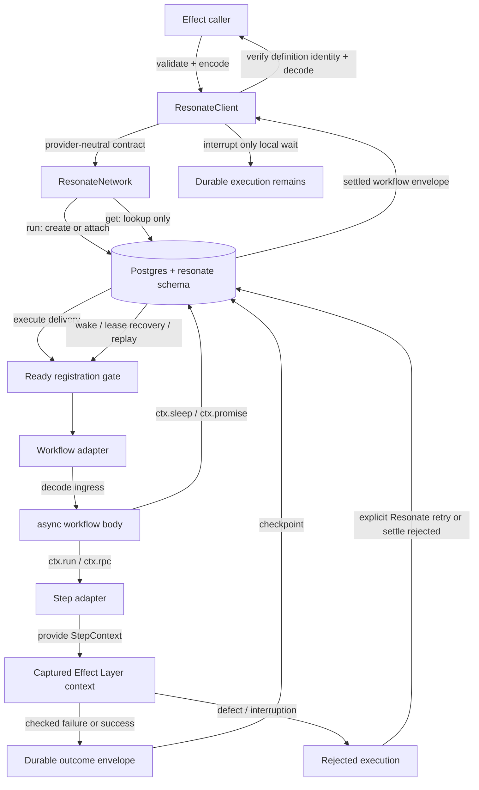
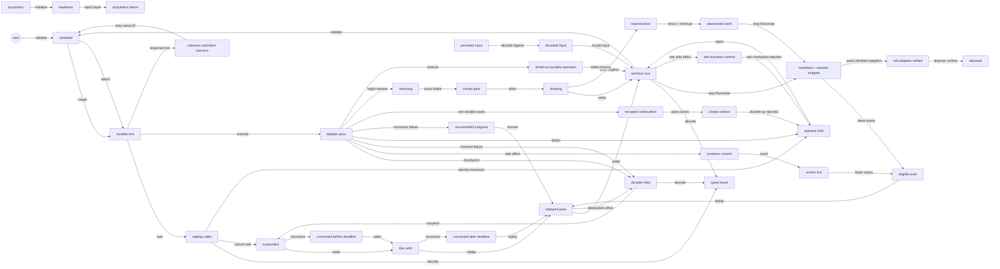

# Network-neutral async core with Postgres provider durability

Status: implementation-ready; approval is the merge gate for this planning PR

> The client/context API vocabulary in this original specification is refined
> by [`2026-09-18-001-resonate-api-parity-spec.md`](./2026-09-18-001-resonate-api-parity-spec.md).
> The later specification governs method names, namespaces, and handle semantics.

## Objective

Define the first usable, network-neutral `@effect-resonate/core` programming
model around `@resonatehq/sdk/async`, then prove its provider contract end to
end by composing the separate Postgres network package in a private runtime
evaluation app. Resonate owns durable orchestration and Effect owns business
effects, typed failures, dependencies, resource lifetime, and tracing.

This specification settles behavior, not the source-file layout. It narrows the
exploration in [`docs/BRAINSTORM.md`](../BRAINSTORM.md) while preserving the
package boundaries in [`docs/PACKAGING.md`](../PACKAGING.md).

## Success criteria

- **SC1 — Typed contracts and implementations.** A consumer can declare
  schema-guarded workflow and step contracts, implement each contract with a
  Layer, register the closed contract group once, and invoke the workflow
  through an Effect service without importing Resonate internals.
- **SC2 — Real Postgres completion.** A private runtime evaluation app obtains
  an isolated Postgres 16+ database through IntegreSQL, applies a pinned upstream
  `resonate.sql` through its template, composes core with the Postgres network
  package, executes a workflow containing a step and durable sleep, and observes
  the decoded result from a different runtime incarnation.
- **SC3 — Recovery.** If the first worker stops after a completed step or while
  sleeping, another worker in the same group resumes the invocation without
  re-running a checkpointed step.
- **SC4 — Duplicate activation.** Two calls with the same execution ID observe
  one durable execution and the same result. A conflicting second input does
  not replace the first input; this first-writer-wins behavior is documented and
  tested. Reuse of the globally scoped ID through a different workflow name or
  version never decodes a resolved envelope as the second workflow's result; a
  wrapper envelope exposes the mismatch as a definition-identity conflict.
- **SC5 — Side-effect crash window.** A fault-injection test stops a worker after
  a step's external Postgres write but before its Resonate result is
  checkpointed. Recovery enters the adapter again with the same stable step
  invocation ID, while a target-system uniqueness constraint leaves one business
  effect.
- **SC6 — Failure distinction.** Tests separately observe a checked Effect
  failure, a defect, malformed workflow input, a timeout, and a transient
  Postgres outage. A checked failure is data in the typed error channel; none of
  the other four is misreported as that domain error.
- **SC7 — Managed lifecycle.** The Layer does not become available until its
  handler Layers, application services, and selected network are usable. Partial acquisition
  releases every resource already acquired. Layer release stops new delivery,
  applies a configured bound to draining tracked in-flight step adapters, stops
  Resonate/network resources before its provided application Layers release,
  without leaking timers, listeners, or pools.
- **SC8 — Durable-value contract.** Workflow and step codecs have
  JSON-compatible encoded forms, encode and decode every persisted function
  value, and reject malformed inputs, outputs, and internal result envelopes.
- **SC9 — Durable workflow discipline.** Examples and tests use only durable
  Resonate awaitables in workflow bodies. A deliberately introduced ordinary
  asynchronous wait followed by a durable operation is rejected by the
  upstream async engine rather than silently escaping the execution pass.
- **SC10 — Packaging.** `@effect-resonate/core` has no Postgres symbols,
  dependencies, configuration, conditionals, or fixtures. The separate
  `@effect-resonate/network-postgres` package wraps the SDK's official Postgres
  network and owns its `pg` peer. A private `@effect-resonate/testing` package
  owns reusable provider-conformance scenarios, and a private
  `apps/postgres-e2e` workspace composes those pieces for runtime acceptance.
- **SC11 — Context surface.** Type and contract tests cover typed `run`/`rpc`,
  durable `sleep`, schema-decoded external promises, replay-stable time/random,
  read-only workflow/step metadata, and client operations that resolve, reject,
  or cancel an external promise without exposing the SDK. Tests exercise each
  category at its actual durable or trust boundary rather than only checking
  method presence.

Each criterion is observable through type tests, unit/contract tests, or the
Postgres integration suite; none depends only on logs or manual inspection.

## Assumptions

- The repository resolves `@resonatehq/sdk` 0.11.5 from the declared `^0.11.4`
  range (`packages/core/package.json`, `pnpm-lock.yaml`). The public contract
  targets the async export and must be verified against the resolved patch at
  implementation time.
- The installed `effect@4.0.0-rc.115` and `@resonatehq/sdk@0.11.5` sources were
  inspected, including Effect's complete `AGENTS.md`, RPC group/server,
  `FiberSet`, Layer, and runtime APIs.
- Every workflow and step contract requires runtime codecs for input, success,
  and checked failure. Their encoded forms must be JSON-compatible. This makes
  old persisted inputs and recovered outputs honest typed boundaries. V1
  boundary schemas must have `DecodingServices = never` and
  `EncodingServices = never`; service-dependent codecs are deferred.
- Contracts are inert and implementation-free. `Step.toLayer` captures the
  services required by its `Effect<A, E, R>` handler; `Workflow.toLayer`
  supplies the Resonate async workflow handler. A contract can therefore be
  imported by workflow or client code without importing its worker implementation.
- `Step.evolve` and `Workflow.evolve` preserve a contract's stable function
  name while creating a strictly newer version, distinct handler identity, and
  explicit lineage. They do not inherit implementations or register ancestors.
  Step contract or observable side-effect changes and workflow contract or
  durable-composition changes require evolution; semantics-preserving refactors
  do not.
- A checked Effect failure means a single expected failure from the Effect error
  channel. A cause containing a defect, interruption, or an ambiguous/composite
  cause is an execution failure, not a domain failure.
- In the required Postgres environment, `pg_cron` advances durable deadlines
  even when no connector is running; `PostgresNetwork` also invokes timeout
  processing opportunistically while connected. A compatible worker is still
  required to consume resulting work and resume workflow code, so recovery time
  has no unconditional wall-clock bound.
- Root and child deadlines are calculated from the creating worker's wall clock
  before Postgres compares them with database time. Operational clock skew must
  remain within the deployment's accepted timeout tolerance.

## Scope boundaries

### In scope

- Inert `Step` and `Workflow` definitions with stable names and positive-integer
  versions, collected through a first-class immutable, flat `ResonateFunctions`
  group shaped like Effect's `RpcGroup`. Definition/group construction is total;
  the client Layer rejects invalid dynamic identities, non-increasing dynamic
  evolution lineage, and duplicate exact pairs through its typed acquisition
  error channel. Every registration and root/child invocation uses the referenced
  definition's exact `(name, version)` pair.
- A workflow context facade for typed `run`/`rpc`, durable `sleep`, externally
  resolved promises with schema decoding, durable time/random operations, and
  read-only execution metadata.
- A per-step Effect service exposing stable Resonate invocation metadata,
  especially the durable step ID used for idempotency.
- One scoped Effect service that owns the Resonate instance, closed registration
  set, captured Effect callback runtime, invocation, input-free attachment by workflow and
  execution ID, external-promise resolution/rejection/cancellation, waiting, and
  orderly shutdown. Module-level operation accessors retrieve that service from
  the Effect context so ordinary callers do not need to address the service tag
  through the module namespace.
- A provider-neutral network service contract in core, plus a separate Postgres
  network Layer around `@resonatehq/sdk/postgres`.
- A narrow provider-author seam that accepts an SDK-compatible network factory
  and sanitized acquisition-error mapping. Workflow, step, context, and client
  APIs remain SDK-free.
- `ResonateClient.layer` retains `ResonateNetwork` as an Effect requirement
  until application composition supplies a provider Layer with
  `Layer.provide`; core does not accept a provider Layer as configuration.
- Provider-neutral contract scenarios in a private testing package, plus an
  IntegreSQL-backed Postgres runtime evaluation app and recovery suite.

### Out of scope

- An Effect workflow interpreter or workflows authored as arbitrary
  `Effect.gen` programs.
- A replacement for Resonate's Postgres protocol, SQL, task leasing, retry
  engine, IDs, or transport.
- Production installation or migration of the `resonate` database schema. The
  operator owns it; test infrastructure may apply a pinned upstream SQL file.
- Exactly-once external effects. The wrapper supplies a stable idempotency key;
  the step and target system must enforce idempotency.
- Automatic workflow/step migration, aliases or fallback-to-latest routing,
  schedules, detached workflows,
  execution graph inspection, or a synthetic event history.
- Cancellation of an already-created durable execution when the waiting Effect
  fiber is interrupted.
- Multi-tenant database policy, credentials management, production retention,
  or garbage-collection automation.

The future inspection API remains independent and read-only as described in
[`docs/EXECUTION-INSPECTION.md`](../EXECUTION-INSPECTION.md).

## Core protocol decision

Checked failures cross Resonate as durable values, not thrown JavaScript
errors. The wrapper owns a versioned, JSON-compatible envelope such as:

```ts
type DurableDefinitionIdentity = {
  readonly kind: "Workflow" | "Step"
  readonly name: string
  readonly version: number
}

type DurableOutcome<A, E> =
  & { readonly protocolVersion: 1; readonly definition: DurableDefinitionIdentity }
  & (
    | { readonly _tag: "Success"; readonly value: A }
    | { readonly _tag: "Failure"; readonly error: E }
    | { readonly _tag: "InvalidInput"; readonly issue: DurableIssue }
  )
```

The exact property names may change during planning, but the three-way protocol
and common protocol/definition identity may not. Root execution IDs retain
Resonate's globally addressed semantics rather than being silently namespaced by
the wrapper. Callers must therefore choose IDs globally across workflow names and
versions. The identity guard prevents a violated precondition from becoming a
typed value from the wrong definition; it does not turn one root ID into multiple
executions. An Effect `Result<A, E>` is reconstructed at the API boundary rather
than serialized directly, because its runtime methods and symbols do not
round-trip through JSON.

Non-domain execution rejection uses a separate JSON-compatible rejection record
carrying the namespaced `ExecutionRejected` tag, execution/definition identity,
and an allowlisted reason. It is thrown so Resonate persists it as a rejected
promise; it is not a fourth resolved `DurableOutcome` branch. This record is
necessary because the SDK codec serializes JavaScript `Error` instances as only
name/message/stack and would otherwise discard tagged-error fields. Raw defects
and stacks are not persisted in this record.

- A step adapter runs the implementation Layer's `Effect<A, E, R>` handler in
  the application Layer context captured at acquisition. It validates and
  decodes the delivered argument with the step input codec before user code.
  Success becomes `Success`; one checked failure becomes `Failure` after the
  corresponding step codec encodes the branch value.
- Defects, interruption, invalid wrapper envelopes, durable encode failures,
  Resonate failures, and exhausted infrastructure retries reject the durable
  operation. The wrapper never automatically classifies them as `E`; workflow
  code may deliberately catch a rejected durable operation and translate it into
  a domain failure.
- A workflow body returns a typed `Result<A, E>`. Its adapter validates/decodes
  input before user code, then encodes either branch using the workflow's
  boundary schemas.
- The Effect-facing client validates before activation and decodes after
  completion. `run` creates or attaches using validated input; `attach` performs
  an input-free lookup and never creates durable state. Both accept the workflow
  definition, verify the final envelope's exact definition identity before
  decoding its payload, and return `Effect<A, E | CoreExecutionError>`. A
  workflow failure becomes `E`; owned validation/protocol failures remain
  specific wrapper errors. Failures observed at the SDK boundary remain one
  thin `ResonateSdkError` carrying the original cause and upstream metadata rather
  than being translated into a parallel error taxonomy.
- A transport failure or caller interruption after activation has been
  dispatched may occur after Postgres committed the root creation. A returned
  connector error preserves the execution ID and reports that activation may
  have committed. An interrupted fiber returns no error value, so the caller
  relies on the ID it supplied and makes the same assumption. Recovery retries
  `run` with the same
  workflow definition, version, input, and execution ID, or calls `attach`; it
  never substitutes a fresh ID.
- Resonate retries remain opt-in. Since checked failures are resolved values,
  they are not retried by Resonate. A step may use an explicit Effect retry
  schedule for typed transient failures within one adapter execution. A caller
  may opt into Resonate retries for rejected attempts, accepting possible
  re-execution and the idempotency obligation. SDK retry counters and backoff are
  scoped to one in-process execution pass and reset after process loss and lease
  redelivery; they are not a durable global attempt budget. An application that
  needs a durable global cap must persist it explicitly or use an absolute
  durable deadline.

This preserves the distinction proposed but left open in
[`docs/BRAINSTORM.md`](../BRAINSTORM.md#error-model).

## Walkthroughs

| ID | Story | Path | Observable result | Invariants | Criteria |
| --- | --- | --- | --- | --- | --- |
| W1 | Checkout `order-42` charges through an Effect step, sleeps, and completes. | validate → create → execute → checkpoint → suspend → wake → replay → settle → decode | The caller receives the typed success; the business-side attempt/effect assertions prove that the step ran and the sleep resumed in another runtime incarnation. | S1, S2, S5, S8, L1, L2, C2, C3, C4 | SC1, SC2, SC8 |
| W2 | Two callers submit `order-42` concurrently with the same input while neither activation has settled. | validate → create → wait → decode / validate → attach → wait → decode | Both callers receive the same result; one root execution exists. | S4, C1 | SC4 |
| W3 | A stale caller reuses `order-42` with different input. | validate → attach → wait → decode | **The original result wins.** No input replacement or second execution occurs. | S4, C1 | SC4 |
| W4 | The first worker stops after the charge checkpoint and before the durable sleep wakes. | execute → checkpoint → suspend → reconnect → wake → replay → settle | A second worker resumes; charge is replayed from its checkpoint and is not executed again. | S1, S6, L2, L3, C2 | SC3, SC7 |
| W5 | A deterministic failpoint kills a worker after the charge side effect commits but before the step outcome is checkpointed. | execute → side effect → crash → lease expiry → replay → idempotent effect → checkpoint → settle | Recovery enters the adapter at least twice with the same durable step ID; the workflow succeeds and the uniqueness constraint leaves exactly one charge row. | S4, L3, C1, C2 | SC5 |
| W6 | `ChargeCard` returns `PaymentDeclined`; a separate step dies with a `TypeError`. | execute → checked failure → checkpoint → decode / execute → defect → reject | Decline appears in the typed domain channel. The defect appears as `CoreExecutionError` and no false success/failure envelope is persisted. | S2, S3, C4 | SC6 |
| W7 | A raw/stale invocation contains input that the current workflow schema cannot decode. | decode ingress → invalid input → settle → decode | User code and steps do not run; the execution completes with a sanitized `InvalidWorkflowInput` wrapper error and is not retried as a defect. | S7, S8, C4 | SC6, SC8 |
| W8 | The application Layer fails, Postgres is unavailable, or the `resonate` schema is missing during startup; in a separate run Postgres drops after activation. | initialize → reject layer / execute → connector failure → recover → replay | Startup cannot report a usable service and rolls back earlier resources. A created invocation is never reported successful because of an outage and can recover after Postgres and a worker return. | S5, S7, L1, L3, C2 | SC6, SC7 |
| W9 | A client waiting on a durable sleep is interrupted, its deadline becomes due while all workers are stopped, and one worker restarts later. | wait → cancel wait → suspend → wake → reconnect → replay → settle → get → wait → decode | Caller interruption only stops that wait. Cron settles the deadline without a worker; a fresh runtime uses `get` without resupplying input and receives the result after a compatible worker returns. | S6, L1, L2, L3, C5 | SC3, SC7 |
| W10 | A workflow awaits a normal timer/I/O promise and then calls `ctx.run`. | execute → non-durable await → pass closes → durable op rejected | **MUST NOT silently continue.** The upstream closed-context guard rejects the late durable operation; tests demonstrate the unsupported pattern. | S1, S3 | SC9 |
| W11 | `order-42` already belongs to `Checkout` v1 when a caller invokes another workflow, or `Checkout` v2, with that global ID. | validate → attach → wait → identity mismatch → reject | **MUST NOT decode under the second definition.** The stored envelope identity produces a tagged definition conflict and no second root execution. | S3, S4, S8, C1, C4 | SC4, SC8 |
| W12 | Postgres commits creation of `order-42`, but the activation response is lost. | validate → create → response lost → retry same ID → attach → wait → decode | The first error says activation may have committed and retains `order-42`; a same-definition, same-input retry attaches and observes the one execution. | S4, L1, C1, C5 | SC4, SC6 |
| W13 | Release begins while a tracked step adapter is blocked, then it completes within the drain bound. | execute → begin release → close intake → drain → settle → stop Resonate/network → dispose runtime | No new adapter starts, the in-flight step settles normally, finalizers run once, release completes, and a repeated release is harmless. | S6, C3 | SC7 |
| W14 | Release begins while a supervised step fiber remains blocked past the drain bound. | execute → begin release → close intake → drain → drain expires → abandon/fence/interrupt → stop Resonate/network → lease expiry/replay on another worker; old adapter settles → dispose old runtime | No success or checked failure is fabricated; stopping the connector releases its lease independently of an uninterruptible old adapter, whose fenced Exit cannot checkpoint. Runtime disposal waits for its promise/finalizers. | S6, L3, C2 | SC3, SC7 |
| W15 | `ChargeCard` remains in flight past its durable deadline and commits afterward. | execute → timeout → settle timeout → late side effect → late checkpoint rejected | The caller observes `ResonateSdkError`, never domain `E`; timeout does not imply cancellation or absence of an external effect, and the timed-out durable state is not overwritten. | S3, S4, S9, C2 | SC5, SC6 |

## Protocol and dataflow



Walkthrough `Path` cells use the transition labels below; `/` separates
alternative paths in one row. Every transition is exercised by at least one
walkthrough.



Lifecycle order is part of the protocol:

1. Accept one complete readonly `ResonateFunctions` contract group and require
   the corresponding workflow/step handler services plus `ResonateNetwork` in
   `ResonateClient.layer`'s input channel. Duplicate `(name, version)`
   identities fail before delivery; multiple distinct versions may coexist.
2. Acquire the handler, application-service, network, and internal scoped
   `AdapterSupervisor` Layers through ordinary `Layer.provide` composition.
   Capture the acquired Effect context once for SDK callbacks. Any dependency
   Layer failure remains in the composed Layer error channel and prevents
   service exposure.
3. Construct one official network and async Resonate instance behind a delivery
   gate, registering each resource's finalizer before the next fallible readiness
   action. Register every workflow and step using its exact `(name, version)`
   before delivery is released.
4. Await connector initialization/readiness before exposing the Layer service.
   Initialization rejection fails Layer acquisition even though the upstream
   constructor otherwise logs asynchronous initialization failures. Any failure
   closes the gate and releases all already-acquired runtime, network, listener,
   polling, and timer resources in reverse ownership order.
5. On release, stop accepting/delivering new work and apply the configured bound
   to step fibers already registered in a scoped Effect worker `FiberSet`.
   Admission and registration are atomic with closing. If the bound expires,
   fence their durable completion, mark the supervisor abandoned, and run the
   worker-set interruption request inside a second scoped `FiberSet` so network
   shutdown is not blocked by uninterruptible cleanup. Resonate continues to own
   workflow promises. Invoke
   `Resonate.stop()` once so its heartbeat and owned network stop and lease-based
   recovery can proceed; do not also stop that network independently. Then await
   every admitted adapter promise and its finalizers before the enclosing Layer
   scope releases handler and application resources. A raw-network finalizer is armed only during partial acquisition
   before ownership transfers to Resonate. The drain duration does not bound
   uninterruptible user code or finalizers; applications requiring bounded process
   exit must make both cooperative. Repeated release is harmless.

## Invariants

### Safety

| ID | Invariant and enforcement | Exercised by | Counterexample attempted and guard |
| --- | --- | --- | --- |
| S1 | Workflow code issues I/O, timers, randomness, calls, and signals only through the wrapper's durable context. Type surface, documentation, and the upstream closed-context guard enforce this; arbitrary Effect programs execute only in registered step adapters. | W1, W4, W10 | A normal `setTimeout` resumes after the pass and calls `ctx.run`; the context is closed and rejects it. |
| S2 | A checked Effect failure is never serialized as a generic thrown `Error`; it is a resolved, versioned durable failure value. The adapter's `Exit` mapping enforces this. | W1, W6 | `PaymentDeclined` sent through a rejecting Promise bridge would become an SDK rejection; adapters capture `Exit` and encode the declared failure schema instead. |
| S3 | The wrapper never automatically presents a defect, interruption, malformed protocol value, identity conflict, or encode failure as domain `E`. Cause classification and client/context envelope decoding enforce this; explicit workflow recovery may deliberately translate a caught execution failure. | W6, W10, W11, W15 | A `TypeError` handled by a blanket adapter mapper would look like `PaymentDeclined`; only a simple checked-failure cause maps automatically to `Failure`. |
| S4 | Globally addressed root IDs and generated step IDs are idempotency keys, not attempt IDs. Reusing one root ID cannot replace its original definition, version, parameters, or settlement; external side effects that need once-only business behavior use the stable step ID or an equally stable domain key. Resonate ID deduplication, definition-identity validation, and target-system uniqueness enforce this. | W2, W3, W5, W11, W12, W15 | A second request changes the amount or definition for `order-42`; it can attach but cannot replace or decode under the wrong contract. A crash-window replay inserts the same step key and the unique constraint deduplicates it. |
| S5 | A service is never exposed before handler/application Layers, the exact definition registry, and selected network are ready. Core's scoped acquisition and closed delivery gate enforce the generic rule; each provider defines its readiness check. | W1, W8 | A checked dependency-Layer failure or provider readiness failure must fail acquisition and roll back acquired resources before delivery. |
| S6 | Releasing or interrupting an Effect scope does not convert active durable work into a successful or checked-failure settlement. Wait cancellation detaches; ordered shutdown drains or leaves work for lease recovery. | W4, W9, W13, W14 | Releasing application services before stopping intake interrupts a step and could reject it permanently; Layer dependency ordering and the client finalizer forbid that sequence. |
| S7 | Connection strings, raw persisted payloads, causes/stacks, and schema input are not included in wrapper-owned contract errors, durable values, safe error projections, or default logs. A thin in-memory `ResonateSdkError` deliberately retains the original SDK `cause` for debugging, but logging adapters expose only its allowlisted metadata by default. | W7, W8 | A schema issue echoes a payment token or the `pg` error echoes a URL; sentinel-based acceptance proves sanitization prevents either crossing a durable or default-log boundary while explicit cause inspection remains possible. |
| S8 | Every persisted wrapper value is JSON-compatible after boundary encoding. Workflow and step codecs plus runtime JSON validation enforce payloads; envelope decoders reject unknown protocol versions, tags, definition identities, or contradictory payload fields. | W1, W7, W11 | A step returns a value its success codec cannot encode, or that codec emits a non-JSON value; encoding rejects it before the SDK can coerce or lose it. |
| S9 | A durable timeout fences the durable promise but does not claim to interrupt already-running Effect code or prevent a late external side effect. Idempotency remains required, and late settlement cannot replace the timed-out durable state. | W15 | A caller treats the rejected `ResonateSdkError` as proof that no charge landed; the blocked adapter later commits, demonstrating why the stable idempotency key remains mandatory. |

### Liveness

| ID | Invariant and enforcement | Exercised by / basis | Counterexample attempted and condition |
| --- | --- | --- | --- |
| L1 | A durably created invocation eventually reaches terminal settlement provided Postgres and timeout processing remain available, a worker with the exact registered `(name, version)` remains available long enough to execute each pass, the workflow reaches each durable boundary in finite time, and every awaited external promise or operation settles or has a finite timeout. | W1, W8, W9, W12; derived from connector outage, caller loss, and worker-loss failures. | An external promise has no resolution or timeout, or the exact version is never deployed again; the corresponding precondition is false and no settlement claim is made. |
| L2 | A due sleep/timeout is eventually settled by the required `pg_cron` job even without a worker; a connected `PostgresNetwork` may also advance it opportunistically. Workflow execution resumes only after a compatible worker consumes the resulting work. | W1, W4, W9; derived from timer-driver and worker-loss failures. | Cron and every connector remain unavailable; deadline processing has no executor, so timer-driver availability is an explicit precondition. |
| L3 | Work abandoned by process loss or drain expiry is redelivered and resumes after its lease permits recovery, provided its durable deadline still permits execution and Postgres plus a worker with the exact `(name, version)` remain available. | W4, W5, W8, W9, W14; derived from crash and partial-failure modes. | The durable deadline expires or the exact function version is no longer registered anywhere; a recovery precondition is false rather than a claim that latest code may take over. |

### Consistency

| ID | Invariant and enforcement | Exercised by | Counterexample attempted and guard |
| --- | --- | --- | --- |
| C1 | One globally scoped root ID denotes one immutable logical invocation while its durable record is retained; all callers attach to its original definition identity, parameters, and settlement. Resonate create-conflict semantics enforce first writer wins, and the wrapper rejects rather than decodes a mismatched definition identity. | W2, W3, W5, W11, W12 | A caller assumes the same ID with new input, workflow, or version means a new run; the API documents the original-result or identity-conflict behavior. |
| C2 | A successfully checkpointed child outcome is replayed from Postgres and not re-executed; an uncheckpointed child may execute again, while a late checkpoint cannot replace an already timed-out settlement. Resonate owns these decisions. | W1, W4, W5, W8, W14, W15 | The process dies on opposite sides of checkpointing, drain expiry, or timeout; W4, W5, W14, and W15 intentionally produce different execution/settlement results. |
| C3 | All step adapters in one wrapper scope use the same acquired handler/application Layer graph; per-invocation `StepContext` is added without rebuilding application services. | W1, W13 | A database Layer is rebuilt per attempt and produces inconsistent pools/configuration; the client Layer captures one shared context whose dependencies outlive drain and release afterward. |
| C4 | Every checked outcome crossing a durable boundary has one recognized protocol version, exact definition identity, recognized outcome tag, and exactly the corresponding payload field. Wrapper-owned decoders enforce this before reconstructing `Result`. | W1, W6, W7, W11 | Old/corrupt data says `Success` with only `error`, names another definition, or has an unknown version/tag; decoding yields a tagged wrapper error, not a cast value. |
| C5 | A root invocation remains addressable by its global execution ID while its durable record is retained, independently of any caller fiber or worker incarnation. | W9, W12 | The initiating caller is interrupted and loses its handle; a fresh runtime uses `attach` and observes the retained execution without creating another root. |

## Failure taxonomy

| Class | Examples | Durable representation | Retry ownership | Caller observation |
| --- | --- | --- | --- | --- |
| Typed domain failure | `PaymentDeclined`, `OutOfStock` | Resolved `Failure` envelope, payload encoded by the workflow error schema at workflow egress | Not retried by Resonate. A step may explicitly retry typed transient values with Effect before returning. | Workflow code receives `Result`; final workflow failure becomes `E`. |
| Malformed workflow input | Invalid external request, old persisted shape | Resolved `InvalidInput` envelope; user workflow is not entered | Non-retryable by construction because it is a resolved value | Tagged `InvalidWorkflowInput` with sanitized issues |
| Defect / contract defect | `TypeError`, die, mixed cause, bad internal envelope, wrong definition identity, non-JSON result | Rejected durable operation or client-side protocol/identity rejection | No retry by default; explicit Resonate policy may retry an uncaught execution attempt | Tagged `ExecutionRejected`, `DefinitionConflict`, or `DurableProtocolError`; never automatically `E` |
| Retryable infrastructure failure | Lost DB connection, Resonate server rejection, rate limit promoted for another execution attempt | Rejected attempt, unrecorded task progress, or unknown activation outcome | Effect retry within a step, or explicit Resonate retry within an SDK execution pass; process loss resets the SDK retry loop and requires idempotency | Thin `ResonateSdkError` retaining the cause, upstream `code`/`type`/`href`/retriability/server status when present, operation context, and whether the request may have committed |
| Timeout | Workflow/child durable deadline reached | `rejected_timedout` Resonate promise; late settlement cannot overwrite it | Governed by Resonate timeout and retry options; does not interrupt an already-running Effect | Thin `ResonateSdkError` retaining the SDK cause; caller must not infer that no external side effect occurred |
| Caller cancellation | Waiting Effect fiber interrupted, including after activation dispatch | No cancellation of an already-created execution; activation commit may be unknown if interruption races creation | Caller uses `attach` or repeats `run` with the same identity and input | Local interruption; durable execution remains independent after creation |
| Worker shutdown/crash | SIGTERM during drain, SIGKILL, process loss | No fabricated settlement; task/child remains in last committed state | Resonate lease recovery on another worker | Reattach by ID; eventual result under liveness preconditions |

Effect retry and Resonate retry must not both be enabled accidentally from one
opaque default. Defaults are no retry at the wrapper's Resonate boundary, which
matches the async SDK. Every retry policy is visible at the invocation site and
documented as at-least-once execution. Resonate retry counts and backoff are
per-process-pass behavior, not durable lifetime budgets.

## Trust boundaries

| Boundary | Value treated as `unknown` | Required action |
| --- | --- | --- |
| Caller → client | Workflow input | Decode with the workflow input schema before creating durable state, then encode its JSON wire form. |
| Postgres/Resonate → workflow adapter | Persisted workflow arguments | Decode the expected argument tuple and workflow input schema; on failure return sanitized `InvalidInput` without entering user code. |
| Workflow → step adapter | Step input | Encode with the step input codec before calling the SDK; encoding failure never creates a child invocation. |
| Postgres/Resonate → step adapter | Persisted step/RPC argument tuple | Revalidate tuple arity and decode with the exact versioned step input codec before constructing `StepContext` or running user code. |
| Resonate → workflow context | Step outcome | Validate protocol version, exact step identity, tag, and exclusive payload field, then decode success/failure with the corresponding step codec before reconstructing `Result`. |
| External resolver → client → durable promise | Promise ID and signal/promise value | Resolve through the client with a caller-supplied service-free schema, encode before SDK settlement, and require the workflow to decode with its supplied schema before exposing the value to orchestration. Reject/cancel diagnostics must satisfy the durable JSON contract. Preserve SDK causes and metadata rather than inventing wrapper reason enums. |
| Workflow adapter → Postgres | Workflow success/domain error | Encode with the corresponding service-free workflow boundary schema, attach exact definition identity, then wrap in the owned durable envelope. Encoding failure is a contract defect. |
| Postgres/Resonate → client | Final root settlement/envelope and payload | `run` or `attach` validates the exact workflow identity before payload decoding and decodes success/error with the service-free schema. Owned envelope failures use specific wrapper errors; SDK failures use the thin `ResonateSdkError` without semantic reclassification. |
| Configuration → Postgres provider package | Connection string, group, PID, polling interval, lease/timeout settings | Parse inside `@effect-resonate/network-postgres`, reject invalid values before acquisition, and redact secrets from errors/logs. Core never sees provider configuration. |
| SDK network → wrapper | Messages, initialization errors, shutdown | Use the official SDK protocol implementation; gate delivery until registration, surface readiness failure, and never cast arbitrary network data into domain types. |

The database schema itself is trusted operational infrastructure. V1 detects
missing/incompatible procedures at readiness and runtime but does not validate
or repair arbitrary database corruption.

## Postgres end-to-end acceptance environment

- `apps/postgres-e2e` runs the acceptance suite. It composes
  `@effect-resonate/core`, `@effect-resonate/network-postgres`, and the reusable
  scenarios from the private `@effect-resonate/testing` package. Core and its
  tests contain no Postgres imports, branches, fixtures, or assertions.
- Run pinned IntegreSQL and Postgres 16+ services. The Postgres image provides
  `pg_cron`; push extensions are optional because the SDK also uses
  `LISTEN`/`NOTIFY` and fallback polling. Use
  `@devoxa/integresql-client` to initialize a migration/fixture-hashed template
  once per runner and request a fresh isolated database for each test.
- Apply a commit-pinned copy of upstream `resonate-pg/resonate.sql` while
  initializing the IntegreSQL template. The hash covers the SQL contents,
  upstream revision, Postgres image/extension configuration, and business-side
  fixtures. Close every template connection before finalization so IntegreSQL
  can clone it. Do not silently pull `main` during tests and do not expose schema
  installation as production API.
- Fixture readiness verifies the Postgres version and required Resonate
  procedures while connected to the leased test database. Through a separate
  connection to the cluster's cron control database, it verifies the `pg_cron`
  extension and the active timeout job targeting that lease. Because `pg_cron`
  is installed in only that control database, the app registers each test with
  `cron.schedule_in_database(...)` and unschedules it before releasing the
  IntegreSQL lease. Upstream SQL may warn rather than fail when cron scheduling
  is unavailable.
- `@effect-resonate/network-postgres` uses `@resonatehq/sdk/postgres` directly,
  owns `pg` as a peer/development dependency, and never queries Resonate's
  private tables in production code. The provider depends on core's public
  `ResonateNetwork` seam; core never depends on the provider or `pg`.
- IntegreSQL owns isolated test-database creation and recycling. Each test closes
  every worker, listener, and pool before releasing its database. Template and
  database cleanup are idempotent and target only resources leased by the run;
  execution IDs alone are insufficient isolation because completed IDs remain
  durable until garbage collected.
- Bound test waits and print sanitized durable IDs/states on failure. Never turn
  timing sleeps into correctness assertions; poll observable durable state or
  await handles.
- Run W1, concurrent W2/W3, W4, deterministic W5, W6, W7, both W8 branches, W9,
  W11, W12, W13, W14, and W15 against Postgres. W5 observes at least two adapter
  entries with the same step ID and exactly one business row. W13/W14 prove
  normal drain, drain expiry, idempotent release, and lease recovery without
  asserting private SDK structures. LocalNetwork success is not a substitute for
  these Postgres semantics.
- Focused SDK-backed contract tests cover default single-attempt behavior,
  explicit per-pass retry counts, checked failures remaining resolved values,
  typed `rpc`, external-promise schema decoding, replay-stable time/random, and
  stable metadata across replay. Table-driven decoder tests cover unknown
  protocol versions/tags, wrong definition identities, missing or mutually
  exclusive payloads, and invalid JSON.
- Acquisition tests use a checked application-Layer failure and failures after
  each subsequently acquired resource. The service is never exposed, no durable
  outcome is created, and all earlier runtime/network resources are finalized.
  Type tests reject workflow boundary schemas with encoding or decoding service
  requirements.
- Type and packed-consumer tests compile all public entrypoints, prove negative
  durable-value cases, and verify declarations and peer resolution independently
  for core and the Postgres provider. A core-only consumer has no `pg` edge; a
  Postgres consumer installs the provider and `pg` explicitly.
- Redaction acceptance injects sentinel secrets through malformed input, schema
  issues, connection URLs, causes, and stacks. Returned errors and captured
  default logs contain safe tags/IDs but none of the sentinels or raw payloads.
- After repository bootstrap, one documented command starts or connects to
  IntegreSQL/Postgres, initializes or reuses the hashed template, runs the
  bounded suite, releases all leased databases, and cleans up services it
  started. Container tooling plus network access or pre-populated caches are
  prerequisites; first-run offline execution is not a requirement.

## Open questions

### Decisions required before planning

None. The durable failure protocol, schema placement, retry ownership,
definition identity/version dispatch, registration closure, attachment,
network/provider ownership, shutdown behavior, and first-writer-wins ID semantics
are decisions of this specification. Changing one requires revising the spec.

### Facts implementation may discover safely

- Which minimal adapter/gate around the SDK `Network` most cleanly exposes its
  constructor-started `init()` promise and buffers delivery until registration.
  The observable readiness and ordering requirements above are fixed.
- Which Effect 4 cause/exit combinators most precisely identify one checked
  failure and which schema APIs best express JSON encoded forms. Behavior above
  is fixed; implementation must use the installed source rather than memory.
- The exact property names and representation of common envelope metadata. The
  protocol version, definition kind/name/version, three outcome alternatives,
  and identity-before-payload validation order are fixed.
- Which commit of `resonate-pg` is compatible with resolved SDK 0.11.5 and which
  Postgres image provides `pg_cron` reliably behind IntegreSQL in local and CI
  runs.
- The smallest bounded-shutdown primitive needed to track active adapters. The
  drain ordering and lease-recovery fallback are fixed.
- The deterministic test-only failpoint mechanism used to prove response loss,
  the side-effect/checkpoint crash window, and drain expiry without exposing
  production fault-injection API.

## Source constraints

- [`docs/BRAINSTORM.md`](../BRAINSTORM.md): async engine choice, ownership split,
  schema/codec direction, error-model exploration, managed runtime, and v1
  scope.
- [`.agents/conventions/durable-execution.md`](../../.agents/conventions/durable-execution.md): durable orchestration versus arbitrary Effect boundary and JSON defaults.
- [`.agents/conventions/effect.md`](../../.agents/conventions/effect.md): installed-source verification and Effect service/layer expectations.
- [`.agents/conventions/repository.md`](../../.agents/conventions/repository.md)
  and [`docs/PACKAGING.md`](../PACKAGING.md): a network-neutral core, provider
  packages at real dependency/runtime boundaries, private shared test support,
  bundler-free output, and peer dependencies.
- [`packages/core/package.json`](../../packages/core/package.json) and
  [`pnpm-lock.yaml`](../../pnpm-lock.yaml): declared and resolved dependency
  versions.
- Upstream contracts verified for this spec: the async SDK's eager durable
  operations and opt-in retries, `PostgresNetwork` lifecycle and polling, and
  `resonate-pg`'s Postgres 16+/schema requirements. These remain upstream-owned
  behavior and must be pinned in integration tests.
- [IntegreSQL](https://github.com/allaboutapps/integresql) and its
  [TypeScript client](https://github.com/devoxa/integresql-client): hashed
  template initialization, isolated database leases, and connection cleanup
  before template finalization.
- [`pg_cron`](https://github.com/citusdata/pg_cron): one extension-control
  database per cluster and cross-database scheduling through
  `cron.schedule_in_database(...)`.
