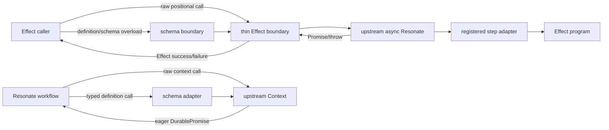

# Thin wrapper simplification

## Objective

Reduce `@effect-resonate/core` to the smallest public and internal surface that
adds concrete Effect or durable-contract value. Raw APIs follow
`@resonatehq/sdk/async` directly; wrapper-owned types and runtime adapters exist
only for Effect return/error channels, scoped lifecycle, schema-aware contracts,
and validation at durable trust boundaries.

This refines the parity direction in
[`docs/specs/2026-09-18-001-resonate-api-parity-spec.md`](./2026-09-18-001-resonate-api-parity-spec.md)
and the small-wrapper boundary in [`docs/BRAINSTORM.md`](../BRAINSTORM.md).

## Success criteria

1. Raw client, handle, registered-function, promise, and schedule calls retain
   upstream method names, namespace paths, positional parameters, option types,
   and return semantics; only `Promise`/throw boundaries become `Effect`.
2. Schema-aware overloads are additive and positional. A definition or schema
   adds encoding and decoding without creating a second request-object API.
3. Client constructor options are derived from the installed async SDK and
   forwarded unchanged except for `network`, which remains Layer-owned;
   `drainTimeout` is the sole wrapper-owned constructor option.
4. Step and workflow versions are ordinary `number` values at the public type
   boundary. One runtime validator enforces non-empty names, positive integer
   versions, increasing evolution, valid lineage, and uniqueness before
   registration.
5. Function groups are plain immutable values. Creating, adding, and merging a
   group does not manufacture a function, constructor, class, or prototype
   contract.
6. `WorkflowContext` derives its raw surface from the public upstream `Context`
   and delegates unchanged members. Wrapper code overrides only operations that
   need schema-aware overloads or result decoding.
7. An SDK patch that changes a raw public signature causes a compile-time parity
   failure instead of being hidden by a copied wrapper request type.
8. Existing durable envelopes, schema validation, identity checks, Effect step
   boundary, lifecycle gate, drain behavior, and once-only shutdown semantics
   remain intact unless this specification explicitly changes them.

## Assumptions and scope boundaries

- The target is the installed async engine, `@resonatehq/sdk/async`; generator
  APIs are out of scope.
- Resonate owns durable orchestration, retries, IDs, schedules, promises, and
  eager workflow-context operations. Effect owns services, Layers, typed
  failures, resource safety, and arbitrary application programs inside steps.
- Raw API callers accept upstream positional syntax. Named request objects are
  removed rather than supported as a parallel compatibility vocabulary.
- `ResonateNetwork` remains the one deliberate constructor substitution:
  applications provide it as a Layer dependency, so the upstream `network`
  option is excluded. All other constructor options remain upstream values even
  when Resonate gives them no effect in the presence of an injected network.
- Removing the class-like function-group shape is an intentional pre-release
  API change. Callers use a value such as
  `const Functions = ResonateFunctions.make(A, B)` rather than extending it.
- This work does not remove typed `Step` or `Workflow` definitions, versioned
  durable envelopes, or schema codecs. Those protect persistence boundaries and
  are not raw-SDK parity shims.
- Packaging, provider topology, execution inspection, and release automation
  are out of scope.

## Public API direction

Raw overloads mechanically mirror upstream positional calls:

```ts
yield* ResonateClient.run(id, funcOrName, ...args)
yield* ResonateClient.promises.create(id, timeoutAt, options)
yield* ResonateClient.schedules.create(id, cron, promiseId, promiseTimeout, options)
```

Typed overloads preserve the same ordering while substituting a contract for
the upstream function/name and adding only the data required by that contract:

```ts
yield* ResonateClient.run(id, Checkout, input, options)
yield* ResonateClient.get(id, Checkout)
yield* ResonateClient.promises.resolve(id, schema, value)
```

Exact overload types derive from public SDK declarations wherever the wrapper
does not add a schema or definition. Public module entrypoints remain stable.

## Walkthroughs

| ID | Story | Path | Observable result |
| --- | --- | --- | --- |
| W1 | An application follows an upstream raw `run` example | positional `run` → SDK handle → Effect handle | The call translates by replacing `await` with `yield*`; arguments and options are unchanged |
| W2 | An application invokes a typed workflow | positional `run` with `Workflow` → input encode → SDK → result decode | Only schema validation and the Effect handle are additive |
| W3 | A webhook uses the raw promises namespace | positional `promises.create` → `resolve` | Upstream records and first-writer-wins behavior pass through unchanged |
| W4 | A worker registers an invalid or non-increasing version | definition creation → group → client acquisition | Runtime registration validation fails before the network opens; no type-level arithmetic is involved |
| W5 | Two definition groups are combined | plain group value → `add`/`merge` → client acquisition | Registration order and exact handler requirements are retained without a fake constructor |
| W6 | A workflow calls raw and typed context operations | upstream `Context` → delegated raw call or schema-aware overload | Calls stay eager `DurablePromise`s and no Effect runtime enters workflow orchestration |
| W7 | An SDK patch adds or changes a raw option/parameter | dependency update → typecheck | Derived signatures change or parity assertions fail; copied request interfaces cannot conceal the drift |
| W8 | A step dies with an error listed in `nonRetryableErrors` | Effect defect → original `Error` → SDK retry classifier and codec | The SDK performs one attempt and owns the persisted error representation |

## Invariants

### Safety

- **S1 — No invented raw protocol.** A raw operation neither renames fields nor
  repacks positional parameters into wrapper-owned request objects. Enforced by
  signatures derived from public SDK methods and exercised by W1/W3/W7.
  Counterexample: adding a new upstream parameter succeeds in the wrapper while
  being dropped before the SDK; derivation or parity assertions must reject it.
- **S2 — Typed behavior is visibly additive.** Selecting a definition or schema
  is the only trigger for wrapper encoding, decoding, or owned protocol errors.
  Enforced by overload dispatch and exercised by W2/W6.
  Counterexample: a raw promise value is schema-decoded; raw tests must prove it
  is returned unchanged.
- **S3 — Invalid identities never reach registration.** Every definition and
  ancestor is runtime-validated before the network opens. Enforced by the
  registry and exercised by W4.
  Counterexample: a dynamic `NaN`, zero, fractional, cyclic, or non-increasing
  ancestor reaches `resonate.register`; acquisition tests must reject each
  reachable class of invalid lineage.
- **S4 — Workflows remain Resonate programs.** Context calls remain eager and no
  arbitrary Effect program is run between durable operations. Enforced by the
  context boundary and exercised by W6.
  Counterexample: a typed context overload returns a lazy `Effect`; type and
  runtime tests must reject that shape.
- **S5 — Cleanup remains once-only and cancellation-safe.** Simplifying public
  APIs cannot weaken admission fencing, draining, or shared shutdown ownership.
  Enforced by the existing gate/supervisor lifecycle and regression tests.
  Counterexample: cancellation of the first explicit `stop` waiter poisons the
  shared cleanup result; the remaining waiter and Layer finalizer must still
  complete one SDK stop.

### Liveness

- **L1 — Upstream capability remains reachable.** Every installed public raw
  client and context operation remains callable unless replaced by the explicit
  Layer lifecycle substitution. Exercised by W1/W3/W6/W7. A newly added SDK
  method that disappears behind the wrapper falsifies this invariant.
- **L2 — Admitted steps still settle or are fenced before shutdown.** Removing
  structural abstractions does not alter the existing bounded drain contract.
  A blocked step retaining application resources after network stop falsifies
  this invariant.

### Consistency

- **C1 — One upstream vocabulary.** Raw calls use Resonate names, namespaces,
  parameter order, options, records, and handles. Typed overloads do not create
  a parallel namespace. Exercised by W1–W3. A raw-only wrapper request field
  falsifies this invariant.
- **C2 — One definition validator.** Compile-time number arithmetic does not
  duplicate runtime identity rules. Static types preserve inference; runtime
  validation owns value correctness. Exercised by W4. A valid runtime integer
  rejected by template-literal arithmetic falsifies this invariant.
- **C3 — Groups are data.** A group is only an immutable ordered collection plus
  type information for required handlers. It has no callable or constructable
  runtime identity. Exercised by W5. Requiring `class extends` or allowing
  `new Group(...)` falsifies this invariant.
- **C4 — Raw context tracks upstream.** The wrapper derives or extends public
  upstream context types and delegates members it does not enrich. Exercised by
  W6/W7. An upstream context member missing from the wrapper after an SDK update
  falsifies this invariant.

## Dataflow



## Failure taxonomy and trust boundaries

- **Typed domain failure:** a simple checked Effect failure is encoded by its
  declared schema and remains a resolved durable failure value.
- **Defect or interruption:** never becomes declared domain failure. A single
  `Error` defect passes through unchanged so Resonate owns retry classification
  and serialization. Wrapper-originated contract failures, interruption,
  composite causes, and non-`Error` defects use the structured durable rejection.
- **SDK/network failure:** remains a thin `ResonateSdkError` retaining upstream
  cause and commit uncertainty. Core does not rewrite logging or provider policy.
- **Malformed durable input/outcome:** remains a wrapper-owned protocol or input
  failure after runtime schema decoding.
- **Invalid definition identity:** fails client acquisition before registration
  and before opening delivery.
- **Timeout/cancellation:** retains Resonate durable semantics; interrupting an
  Effect waiter does not cancel durable execution.

Runtime validation remains required only where values cross an actual trust
boundary: dynamic definition identities, persisted workflow/step arguments,
persisted typed outcomes, external typed promise values, and rejected root
identity. Raw SDK records and options are not revalidated by core.

## Decision: pure upstream `Error` behavior

The installed async SDK decides `nonRetryableErrors` with `instanceof` before
serializing a rejection. A single Effect defect containing an `Error` therefore
passes that exact object through to Resonate. Core does not graft a durable
record onto its prototype, install custom JSON behavior, or otherwise depend on
the SDK's classification/serialization order.

This preserves native `nonRetryableErrors` matching and makes persisted error
messages, stacks, replay reconstruction, and redaction upstream/application
policy. A typed workflow still normalizes an uncaught child error into its root
`ExecutionRejected` boundary, but arbitrary application `Error` defects do not
guarantee wrapper-owned child `source` provenance. Checked Effect failures
remain schema-encoded resolved values and retain their typed domain channel.

## Implementation facts to verify during planning

- Which raw overloads can be expressed directly with `Parameters`/`ReturnType`
  without weakening generic inference.
- Whether extending/intersecting the public async `Context` preserves upstream
  overload resolution while adding definition overloads.
- The smallest plain group representation that retains exact handler Layer
  requirements and immutable registration order.
- Package declaration output and packed-consumer inference after removing the
  class-like group and named request types.
